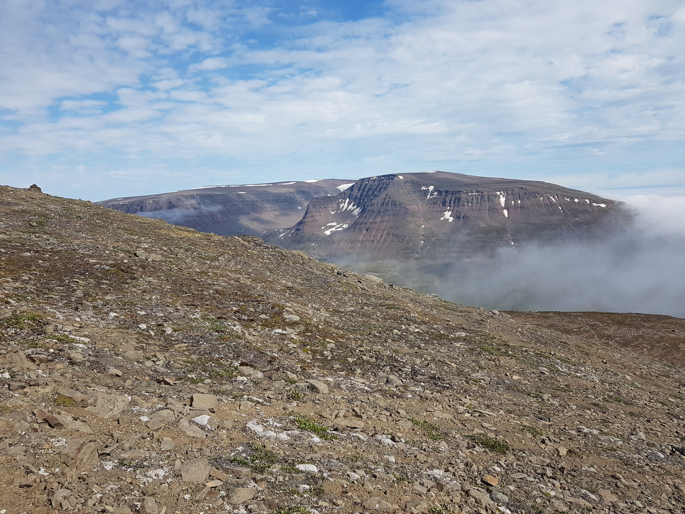

I'm a PhD student, based in the School of Geography at the University of Nottingham (United Kingdom) and the Department of Bioscience at the University of Aarhus (Denmark). My interests lie in the application of remote sensing to tackle ecological problems across a variety of different scales.

My PhD project, entitled 'Changes in arctic and alpine plant communities: the roles of climate and geodiversity' (supervised by Richard Field, Franziska Schrodt and Signe Normand) is attempting to further our understanding of linkages between geodiversity - the diversity of the abiotic environment - and biodiversity. The importance of geodiversity is increasingly being recognised within ecology, yet several key theories including "Conserving Nature's Stage" (CNS) remain empirically untested. The CNS posits that species are actors which play out upon a stage of the abiotic environment (geodiversity) and that by conserving a diversity of the abiotic environment, we can preserve diversity in the biotic environment through time, even if specific species change. Given that the arctic is warming extremely rapidly, responses to climate change are increasingly evident, providing an environment to test whether geodiversity might offer a buffering effect of plant community responses to rapid climate change. Through a combination of plot-scale fieldwork, synthesis datasets and large-scale satellite-based studies, I plan to identify the role of the abiotic environment in influencing change through time in arctic plant communities.

  

